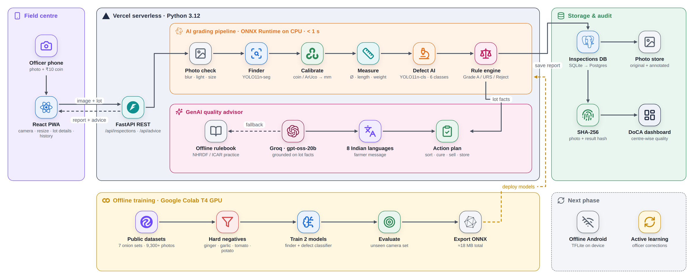

# OnionEye: AI onion grading (SIH26031, DoCA) · Team 200_OK

**Live:** https://project-wnsqw.vercel.app · **Demo video:** https://project-wnsqw.vercel.app/demo.mp4 · **Technical report:** [REPORT.md](REPORT.md)

One photo of an onion sample + a ₹10 coin → every onion found, sized in mm, checked for rot / mould / sprouting / damage,
graded **Grade A / URS / Reject** by the DoCA rules, with lot percentages, a tamper-evident report and a **GenAI advisor**
(what to do with the lot, storage, market, next season; farmer message in 8 Indian languages).

| | |
|---|---|
| Finder v2 (YOLO11n-seg) | box mAP50 **0.967** on 812 held-out photos (P 0.972, R 0.938) · coin 0.995 · unseen camera set 0.815 |
| Other produce (ginger, garlic, tomato, potato) | false "onion" rate **71.3% → 0.7%** after hard-negative training |
| Sizing | ±1.3 mm mean error vs hand-measured onions |
| Defect classifier v2 (YOLO11n-cls) | **89.5%** accuracy on 1,428 held-out crops, 6 classes incl. `not_onion` (F1 0.96) |
| GenAI | Groq (openai/gpt-oss-20b), grounded on measured facts; offline rulebook fallback |

Features: photo capture with sample photos · per-onion table + annotated photo · size histogram vs Grade A band ·
quality score · lot value estimate (₹) · SHA-256 fingerprints + QR · WhatsApp share · centre dashboard · model transparency page.



```
onioneye/
├── frontend/          React + TypeScript (Vite): take photo → see graded report → history
├── backend/           FastAPI: the grading pipeline + API + SQLite
│   ├── app/cv/        size measurement (calibration sheet or coin) – plain OpenCV, no training needed
│   ├── app/ml/        YOLO detector run with onnxruntime (no PyTorch on the server)
│   ├── app/services/  pipeline.py (photo → result), grading.py (the rulebook), advisor.py (GenAI advice)
│   ├── app/rules/     grading_rules.json  ← Grade A / URS limits live here, change without code
│   ├── models/        finder.onnx + classifier.onnx go here after training
│   └── tests/
├── api/index.py       Vercel entry point (the FastAPI app as one Python function)
├── ml/notebooks/      01_get_data → 02_train_finder → 03_build_defect_data → 04_train_classifier → 05_hard_negatives (Colab)
├── ml/onioneye_data.py  dataset-building code the notebooks use (build_notebooks.py regenerates them)
└── docs/              architecture + solution-flow diagrams, calibration sheet PDF (print at 100%)
```

## Run it (Windows)

Two terminals, from the `onioneye` folder.

**Backend**
```powershell
cd backend
python -m venv .venv
.venv\Scripts\activate
pip install -r requirements.txt
uvicorn app.main:app --reload --host 0.0.0.0 --port 8000
```
Check http://localhost:8000/docs (API playground) and http://localhost:8000/api/health.

**Frontend**
```powershell
cd frontend
npm install
npm run dev
```
Open http://localhost:5173. **On your phone** (same Wi-Fi): open `http://<your-laptop-IP>:5173` (find the IP with `ipconfig`) and the camera button works.

**Tests**: `cd backend` then `python -m pytest -q`.

Works **before** the model is trained: print `docs/onioneye_calibration_sheet_A4.pdf`, put a few onions on it, take a photo → sizes + size-based grades. Add `backend/models/finder.onnx` and coin mode + AI onion finding switch on; add `classifier.onnx` and defects (black mould, rot, sprouting, damage) are checked. Each works without the other.

## The plan, from scratch

Full plan (datasets, training, accuracy tests, day-by-day checklist) is in the **OnionEye Build Plan** doc. Short version:

| # | Step | Where | Output |
|---|------|-------|--------|
| 1 | Download 8 public datasets, build Dataset 1 (onion + coin) | Colab: `ml/notebooks/01_get_data.ipynb` (no GPU) | `finder_dataset.zip` in Drive |
| 2 | Train the finder (YOLO11n-seg), test on unseen onionthesis1 | Colab T4: `02_train_finder.ipynb` (~2–3 h) | `finder.onnx` |
| 3 | Crop + label every onion in the defect photos → Dataset 2 | Colab T4: `03_build_defect_data.ipynb` | `defect_dataset.zip` + review sheets |
| 4 | Train the defect classifier (YOLO11n-cls) | Colab T4: `04_train_classifier.ipynb` (~30 min) | `classifier.onnx` |
| 5 | Copy both `.onnx` files into `backend/models/`, restart backend | laptop | defects + coin mode switch on |
| 6 | Real test: 200–300 mandi onions, 150 CSRP caliper cards, 3 officers vs app | | accuracy table for the PPT |

Colab setup: free Roboflow account → Settings → API Keys → private key → in Colab click the key icon (Secrets) → add `ROBOFLOW_API_KEY` → notebook access ON. Everything saves to `MyDrive/onioneye/`. Colab disconnects? Run all again, training resumes.

### ML: what the models do
- **Finder (YOLO11n-seg)**: finds every onion and the reference coin. Trained on CSRP (4,849, with coins) + onion-detection-8hifs (980 Indian heaps) + instance-segmentation-wagk9 (3,476); tested on onionthesis1, a different author's photos.
- **Defect classifier (YOLO11n-cls)**: one label per onion crop: good / black_mould / rotten / sprouted / damaged. Its dataset is made by running the finder over onion-disease-vcsiy, onions-ciqkj and urad/onion-vi5f2 and labelling each onion from the damage boxes inside it, plus onion_sorting and Mendeley healthy bulbs.
- **Size is not learned**: printed sheet (4 ArUco markers) or a ₹10 coin (27 mm).
- **Grades come from `grading_rules.json`**, not the models, so limits change without retraining. Low-confidence onions are flagged "check by hand".
- The backend reads class names from each ONNX file, so the class order can't get mixed up.

### Deployment
- **Demo day: run everything on the laptop**, phone on the same Wi-Fi/hotspot. No dependence on venue internet or free-tier servers going to sleep.
- **Model hosting:** the model is a ~10 MB ONNX file loaded *inside* the FastAPI backend, so it doesn't need a separate ML host. Hugging Face Spaces no longer runs Docker/Gradio apps for free (static pages only on the free plan, as of Sept 2026), so don't depend on it. Hugging Face Hub (free) is still fine for *storing* the model file.
- **Online link for judges (optional):** frontend on Vercel/Netlify (free, static), backend as a Docker container on any free/cheap container host; set `VITE_API_URL` to the backend URL.

## Data credits
Roboflow Universe (CC BY 4.0): csrp-onion-dataset/onion-segmentation, rishabh-thakur/onion-detection-8hifs, yolo-custom-object-detection/instance-segmentation-wagk9, paul-angelo-lavarias-ii/onionthesis1, raj-ujydl/onion-disease-vcsiy, urad/onion-vi5f2, harish-ajankar-waojo/onion_sorting. Roboflow Universe (Public Domain): onion-grading/onions-ciqkj. Mendeley Data (CC BY 4.0): Kulkarni, Pawale, Suryawanshi (2025), doi:10.17632/42bcyncfhy.1.
