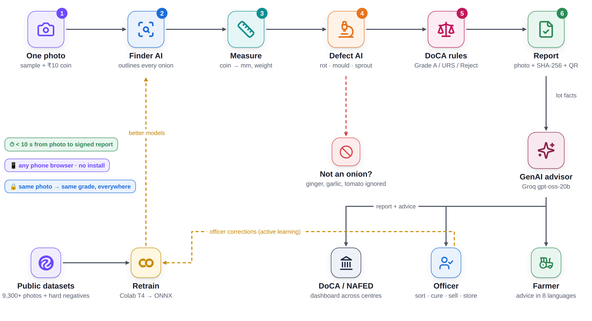

# OnionEye: Technical Report
**SIH 2026 · Problem Statement SIH26031 (Dept. of Consumer Affairs) · Team 200_OK**

> One phone photo of an onion sample plus a ₹10 coin → every onion found, measured in mm, checked for defects and graded **Grade A / URS / Reject**. The app then reports lot percentages and a tamper-evident quality report.

---

## 1. Problem
At NAFED/NCCF procurement centres, onions are graded by eye and by hand with calipers. This is subjective, slow and varies from centre to centre, which causes farmer–agency disputes. DoCA asks for an AI app that:
- assesses quality from images;
- flags damaged, rotten, sprouted and undersized onions;
- estimates the Grade A and URS percentages;
- issues an instant digital report;
- reduces human bias.

## 2. Solution overview
| Step | What happens | Component |
|---|---|---|
| 1 | Officer photographs 30–50 onions spread on a tray with a ₹10 coin (27 mm) or the printed A4 calibration sheet | React PWA (phone browser) |
| 2 | **Finder** model outlines every onion and the coin | YOLO11n-seg → ONNX Runtime |
| 3 | The coin (or the sheet's 4 ArUco markers) gives mm per pixel; each onion's diameter and length are measured and its weight is estimated | OpenCV (`app/cv/measure.py`) |
| 4 | **Defect** model classifies every onion crop: good · rotten · black mould · sprouted · damaged | YOLO11n-cls → ONNX Runtime |
| 5 | Rule engine applies the grade limits from `grading_rules.json`, giving per-onion and lot results | `app/services/grading.py` |
| 6 | Report: annotated photo, table, lot decision, and SHA-256 fingerprints of the photo and the result | FastAPI + React |

Editable version in Eraser: https://app.eraser.io/workspace/R8CFFys5ZIaYCaTEHx0M

## 3. Data
All sources are public. Each source is split into train/val/test by source image, so no image leaks across splits.

**Dataset 1: finder (onion + coin, instance masks)**
| Source (Roboflow Universe) | Used for |
|---|---|
| csrp-onion-dataset/onion-segmentation | onions + reference coin |
| yolo-custom-object-detection/instance-segmentation-wagk9 | onions |
| paul-angelo-lavarias-ii/onionthesis1 | **held-out "unseen" test only** (another author, other camera) |

Result: 6,645 train / 868 val / 812 test images, plus 2,798 unseen test images. Unlabelled photos were dropped so that onions are never taught as background.

**Dataset 2: defect crops (5 classes)**
The trained finder cuts every onion out of the defect photos. Each crop is labelled from the damage boxes that fall inside it.

| Source | good | black_mould | rotten | sprouted | damaged |
|---|---|---|---|---|---|
| raj-ujydl/onion-disease-vcsiy | 513 | 449 | 384 | 483 | 508 |
| onion-grading/onions-ciqkj | – | – | 768 | 155 | – |
| urad/onion-vi5f2 | 3,481 | 376 | 349 | 61 | 155 |
| harish-ajankar-waojo/onion_sorting | 54 | 221 | 86 | 280 | – |
| Mendeley (doi 10.17632/42bcyncfhy.1), healthy bulbs | capped | | | | |

Mendeley *unhealthy* bulbs are held out and never trained on. They are used as an independent sanity check. The `good` class is capped at 3× the largest defect class so the model can't just answer "good".

## 4. Models and training
| | Finder | Defect classifier |
|---|---|---|
| Architecture | YOLO11n-seg (2.8 M params) | YOLO11n-cls |
| Input | 640 × 640 | 224 × 224 |
| Training | Colab T4, batch 16, cosine LR, flips / rotation / HSV augmentation, mosaic off for the last 10 epochs | Colab T4, batch 64, 40 epochs, flips / rotation / HSV augmentation |
| Export | ONNX opset 12 (11.6 MB) | ONNX opset 12 |
| Serving | onnxruntime on CPU, no PyTorch on the server | same |

## 5. Results
**Finder, held-out test set (812 images, 2,808 objects)**
| Class | Box P | Box R | Box mAP50 | Mask mAP50 |
|---|---|---|---|---|
| all | 0.965 | 0.936 | **0.960** | 0.959 |
| onion | 0.933 | 0.872 | 0.925 | 0.923 |
| coin | 0.997 | 1.000 | **0.995** | 0.995 |

On the unseen author set (onionthesis1, 2,798 images, never used in training), box mAP50 is **0.78**. So the finder generalises to new cameras and backgrounds, and the remaining gap is the target for active learning.

**Sizing accuracy vs hand measurement.** Six onions were photographed with a coin, and their diameters were written on labels in the photo:
| True Ø (mm) | 23.9 | 72.1 | 32.1 | 25.6 | 22.5 | 28.8 |
|---|---|---|---|---|---|---|
| OnionEye (mm) | 20.9 | 73.3 | 29.9 | 25.1 | 22.3 | 29.3 |

Mean absolute error ≈ **1.3 mm**, which is well inside the 10 mm width of a grade band.

**Defect classifier v1 (5 classes, 1,034 test crops):** accuracy **88.1%**. F1 scores: good 0.95 · sprouted 0.83 · damaged 0.76 · rotten 0.76 · black mould 0.71 (`reports/classifier_scores.csv`, `classifier_confusion.png`).

**Hard negatives: other produce is not an onion (notebook 05).** The finder was trained on onion photos only, so it also fired on ginger, tomato, garlic and potato.
- **Measured problem:** on 567 held-out photos of other vegetables, finder v1 raised a false "onion" on **71.3%** of photos at confidence 0.5, and on 45.1% at 0.75.
- **Fix 1, classifier v2:** a 6th class, `not_onion`, trained on crops of other produce plus the finder's own false alarms. Test accuracy is **89.5%** over 1,428 crops (not_onion F1 **0.96**). The backend drops a detection when p(not_onion) ≥ 0.8, or ≥ 0.5 while the finder is unsure (< 0.9). This keeps real onions and removes other produce.
- **Fix 2, finder v2:** fine-tuned with ~3,000 photos of other produce as background (empty labels). Result:

| | finder v1 | finder v2 |
|---|---|---|
| False "onion" on other-produce photos, conf ≥ 0.5 | 71.3% | **0.7%** |
| same, conf ≥ 0.75 | 45.1% | **0.4%** |
| Onion + coin box mAP50, held-out test | 0.960 | **0.967** (P 0.972, R 0.938) |
| Unseen author / camera set (onionthesis1) | 0.78 | **0.815** |

Adding background photos fixed the false alarms and also made onion detection slightly *better*.

Speed: about 0.2–0.4 s per 640 px photo on one CPU core (finder + measurement).

## 6. Grading rules (editable, versioned)
`backend/app/rules/grading_rules.json` sets these limits (draft, to be confirmed against the DoCA spec):
- **Grade A:** 45–65 mm, no defect.
- **URS:** 35–70 mm; black mould allowed.
- **Reject:** rotten, sprouted or damaged, or outside the size limits.
- **Lot decision:** Grade A ≥ 90 %, reject ≤ 2 %.
- **Detection threshold:** confidence ≥ 0.5; onions below 0.6 are flagged for a manual check.

Every report prints the rules version, so a change in norms never silently changes old results.

## 7. GenAI quality advisor
`backend/app/services/advisor.py` turns a graded lot into advice: what the numbers mean, what to do with this lot now (sort / cure / sell / store), storage and market tips, prevention for next season, and a short message for the farmer in 8 Indian languages.
- **Grounded.** The quality score, defect counts and sizes are computed in code. The LLM only writes advice around those facts and is told never to invent numbers or give pesticide doses.
- **LLM.** Groq, model `openai/gpt-oss-20b`, JSON mode, set by the `GROQ_API_KEY` env var. Gemini (`GEMINI_API_KEY`) is the backup.
- **Offline fallback.** A rulebook built from standard onion post-harvest practice (NHRDF / ICAR-DOGR) answers when no LLM is reachable, so the feature never breaks.

## 8. API
| Method | Path | Purpose |
|---|---|---|
| GET | `/api/health` | model status and rules version |
| POST | `/api/inspections` | multipart: `image`, `farmer`, `lot_ref`, `centre`, `coin_mm` → full graded result |
| GET | `/api/inspections/{id}` | a stored report |
| GET | `/api/inspections` | recent reports |
| POST | `/api/advice` | JSON `result`, `lang`, `use_llm` → GenAI advice (Groq gpt-oss-20b, or the rulebook) |
| GET | `/api/languages` | supported advice languages |

## 9. Deployment
Everything runs as one Vercel project: the Vite React build plus one Python serverless function (`api/index.py` → FastAPI). The models ship with the function. The ONNX files are split into 3 MB parts and joined into `/tmp` on cold start. Locally, the backend runs with `uvicorn app.main:app` and the frontend with `npm run dev`.

## 10. Limitations and next steps
- Internal rot that is invisible on the skin can't be seen in a photo. It is reported as advisory, and officer spot-cuts are logged.
- The finder is weaker on unseen camera setups. The fix is an active-learning loop: officer corrections are added to training.
- Phase 2 adds an offline Android build (TFLite), a centre-wise DoCA dashboard, and a pilot at a NAFED centre with an officer-vs-app agreement study.

## 11. Reproduce
1. Run `ml/notebooks/01_get_data.ipynb`. It needs a Roboflow key.
2. Run `02_train_finder.ipynb` on a T4.
3. Run `03_build_defect_data.ipynb`.
4. Run `04_train_classifier.ipynb`.
5. Copy the `.onnx` files into `backend/models/`.
